  

- 🌱 Currently learning **Full-Stack Development** and **AI/ML**
- 🛠️ Building with **React / Next.js** and **Python** backends
- 🧠 Working on applied ML/DL, **AI voice agents** and LLM integrations
- 🚀 Projects: **LegalSnap**, **Stocket**, and more at [sarangrastogi.vercel.app](https://sarangrastogi.vercel.app)

 

 

  

  

  

